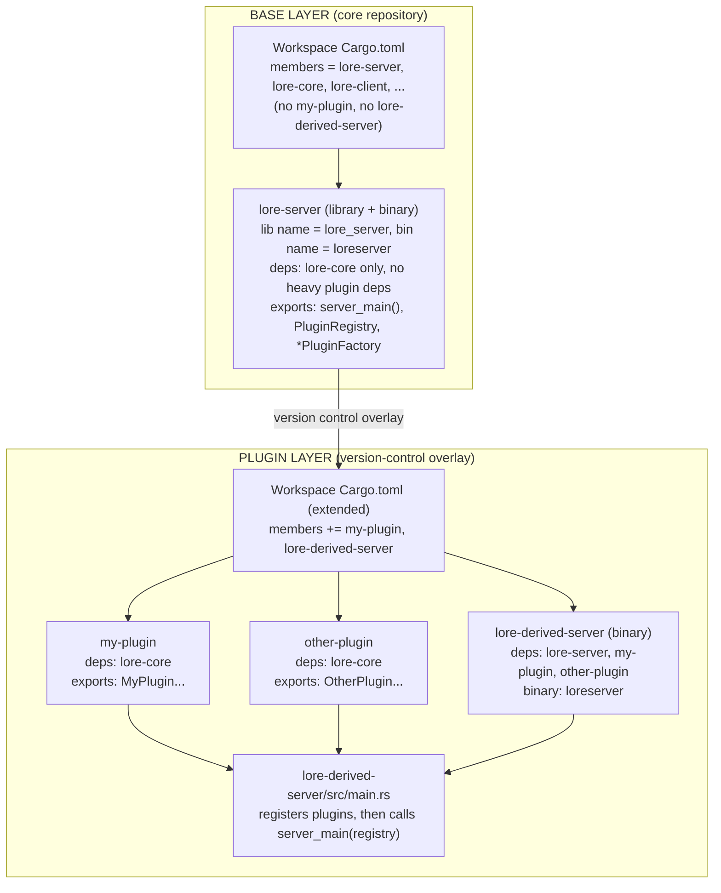
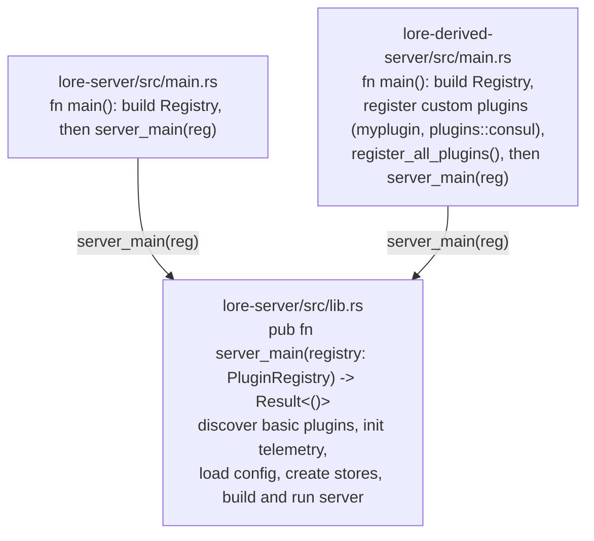
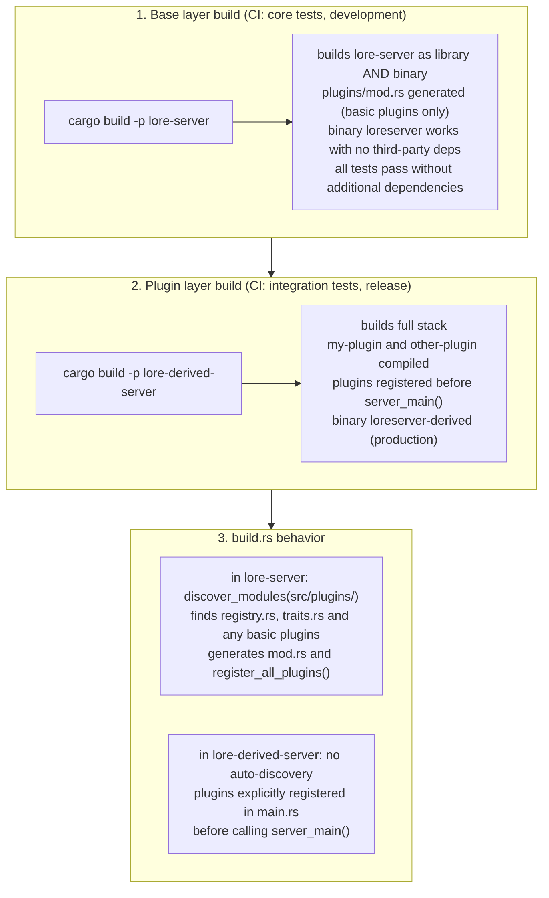

# ADR-00013: Plugin dependency strategy for Lore Server modularization

## Context and Problem Statement

The Lore Server modularization initiative aims to make `lore-server` flexible and decoupled from specific cloud providers
or infrastructure choices. Plugin implementations need to be integrated without tight coupling of the core server to
any third party dependencies pulled in by the plugins.

**Constraints**:

1. **Base workspace `Cargo.toml` MUST NOT be modified** — Plugin crates or their dependencies can't be added as base workspace dependencies
2. **Feature flags can't be used** — Compile-time conditional compilation via Cargo features can't be used as it still makes base workspace depend on plugin dependencies
3. **Plugin files + implementation crates are layered in by version control** — Plugins arrive together with their crate dependencies via version control overlays
4. **`build.rs` discovers plugin files** — Automatic discovery in base server of available plugins without dependencies at build time

**Goal**: Use the plugin system in a way that satisfies these constraints while maintaining:

- Clean separation between core server and plugins
- Easy addition of new plugins
- No modifications to base workspace configuration

## Decision Drivers

- **Zero base modification**: Core workspace and `lore-server` Cargo.toml remain unchanged
- **Compile-time safety**: Invalid configurations should fail at compile time
- **Version control layering**: Plugins integrated via repository overlays (branches, patches, links or layers)
- **Dependency isolation**: Plugin dependencies don't modify the core server build
- **Independent testability**: Core `lore-server` builds and tests without any plugins
- **Runnable base server**: The base `lore-server` should be a functional binary, not just a library

## Considered Options

### Option 1: Feature-gated optional dependencies (rejected)

**Why rejected**: Violates constraint #1 (zero base modification) and requires modifying `lore-server/Cargo.toml` to inject the third party dependencies.

Feature gates can still be used for optional built-in plugins shipping in the core server.

### Option 2: Version-control layered plugin files (rejected)

Plugin `.rs` files and their crate dependencies are layered into `lore-server` via version control.

**How it works**:

- Base layer: `lore-server/src/plugins/` contains only infrastructure (`registry.rs`, `traits.rs`)
- Plugin layer (VC overlay): Adds `myplugin.rs` to plugins directory
- Plugin layer also adds `my-plugin` crate and modifies `lore-server/Cargo.toml`
- `build.rs` discovers plugin files and generates `mod.rs`

**Why rejected**: Violates constraint #1 (zero base modification) and requires modifying `lore-server/Cargo.toml` to inject the third party dependencies.

### Option 3: Binary separation with server_main() entry point (chosen)

A cleaner architecture where:

1. **Base `lore-server`** has a `main.rs` that calls `server_main()` entry point, basic plugins without additional dependencies can be dropped in `plugins/` dir
2. **Derived `lore-derived-server`** crate registers custom plugins with extra dependencies before calling `server_main()`
3. **Custom plugin factory code** lives in derived crate with its own `Cargo.toml` dependencies

## Decision Outcome

**Chosen option: Option 3 (Binary separation with `server_main()` entry point)**

This approach:

1. Keeps `lore-server` as a **functional binary** — not just a library
2. Exposes `server_main()` as a clean entry point for derived crates
3. Allows basic plugins to be dropped directly into `lore-server/src/plugins/`
4. Derived crates extend functionality without modifying base code
5. Heavy dependencies stay isolated in derived crates

### Consequences

**Good**:

- Base `lore-server` can run standalone with basic/no plugins
- Clear separation: infrastructure in `lore-server`, heavy deps in derived crates
- Plugin crate versions can evolve independently
- Smoke tests in CI can test core server without plugin dependencies
- Adding new plugins requires no changes to core crates
- Developers can run a functional server immediately

**Bad**:

- Additional crate to maintain for production deployments in custom environments
- Two binaries exist (base and derived) — need clear naming/usage docs and deploy time selection

**Neutral**:

- Version control workflow changes (overlays instead of features)
- Documentation must clearly explain the two-layer architecture

## Architecture

### Repository structure

```text
# BASE LAYER (always present in repository)
lore/
├── Cargo.toml                    # Workspace - NO plugin crates listed
├── lore-server/                   # Core server (BOTH library AND binary)
│   ├── Cargo.toml                # NO heavy plugin dependencies
│   ├── build.rs                  # Discovers plugins in plugins/ dir
│   └── src/
│       ├── lib.rs                # Exports server_main(), PluginRegistry, traits
│       ├── main.rs               # Calls server_main() with discovered plugins
│       └── plugins/
│           ├── mod.rs            # Auto-generated (discovers basic plugins)
│           ├── registry.rs       # Plugin registry infrastructure
│           ├── traits.rs         # Factory trait definitions
│           └── basic.rs          # Basic plugins without extra dependencies
│
├── lore-core/                     # Core types and traits
├── lore-client/                   # Client library
└── ...                           # Other core crates

# PLUGIN LAYER (added via version control overlay)
├── my-plugin/                    # Custom implementation crate
│   ├── Cargo.toml                # Additional third party dependencies
│   └── src/
│       └── lib.rs                # Exports plugin types
└── lore-derived-server/           # Derived server binary with plugins
    ├── Cargo.toml                # Depends on lore-server + all plugin crates (my-plugin)
    └── src/
        ├── main.rs               # Registers plugins, calls server_main()
        └── plugins/
            ├── mod.rs            # Plugin module declarations
            ├── myplugin.rs       # Custom plugin factory wiring
```

### Component diagram



### server_main() entry point pattern



### Build process flow


